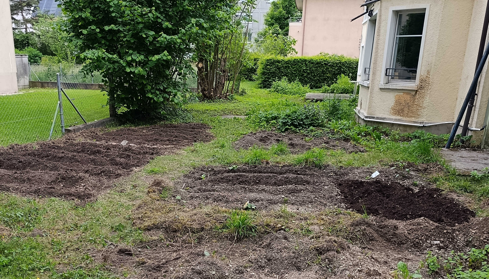
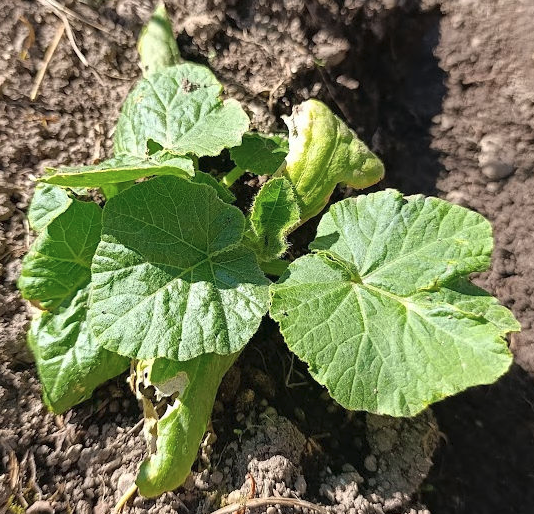
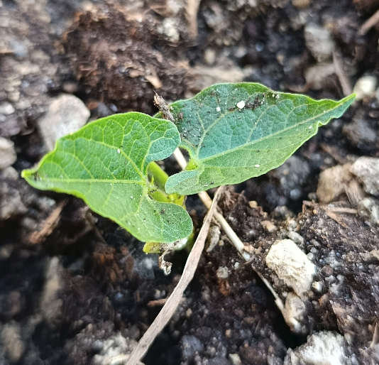

Im Mai 2025 wurde beschlossen, auf der Südseite des Jugendhauses der Kirche Bruder Klaus in Biel, Kreuzplatz, einen Gemüsegarten anzulegen. Es gibt fünf einzelne Gartenparzellen und ein gemeinsames Kräuterbeet.

__Bepflanzung 2025__

- Hauptsächlich Bohnen in den ersten vier Beeten — sie sind robust, bodenverträglich und binden Stickstoff.
- Außerdem: viele Melonen und Kürbisse sowie einige Tomaten und Paprika.
- Minze im Kräutergarten angesät.
- Zitronenmelisse (*Melissa officinalis*) im Kräuterbeet stabilisiert.

|  |  |
|:-------------------------------:|:------------------------------:|

> Kürbis und Bohne 30 Mai, 2025

__To-Do-Liste für 2025__

- Äste, Steine, Moos und Grasbüschel sammeln, um Wege zwischen den Beeten zu gestalten.
- Beet 5 fertig vorbereiten und den Kräutergarten erweitern.
- Teilweise kiesigen Boden durch nährstoffreichere Erde aus der Blumenwiese ersetzen.
- Erdbeerbeete umpflanzen und ordnen.
- Jäten, gießen und den Garten pflegen!

__Interesse?__

Für 2025 gibt es noch freie Parzellen (auch wenn das meiste bereits von Gabrial Erismann bepflanzt wurde — du kannst die Ernte mitnehmen und dir eine Parzelle fürs nächste Jahr sichern!). Zwei Parzellen sind frei — melde dich bei der Kirche Bruder Klaus oder bei Gabrial Erismann, wenn du in der Nähe wohnst und Lust hast, ein Beet zu pflegen!
