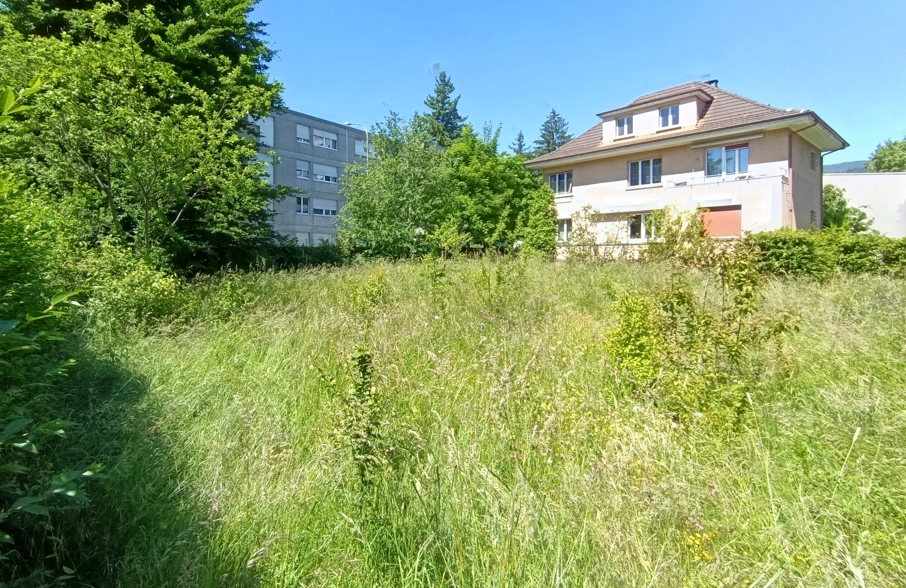

Die etwa 400 m² große Wiese auf dem Gelände der Kirche Bruder Klaus ist ein schönes Stück Natur und Biodiversität im Herzen des Quartiers Madretsch. Auch wenn noch einige Wildblumen vorhanden sind (siehe unten), wird sie zunehmend von Gräsern und Sträuchern überwuchert und verliert ihren Charakter als Blumenwiese. Ziel ist es, die Wiese zu regenerieren, sie weiter zu verbessern und eine pflegeleichte Wildblumenwiese zu schaffen, die dem Quartier als Lern- und Lebensraum für Artenvielfalt dient.

<table>
  <tr>
    <td style="text-align: center;">
       
      <small>Achillea millefolium</small>
    </td>
    <td style="text-align: center;">
       
      <small>Dianthus carthusiana</small>
    </td>
  </tr>
  <tr>
    <td style="text-align: center;">
       
      <small>Silene nutans</small>
    </td>
    <td style="text-align: center;">
       
      <small>Centaurea jacea</small>
    </td>
  </tr>
</table>

__Ziel 1: Regeneration__  
Erster Schritt ist die Regeneration der Wiese nach mehreren Jahren ohne Pflege.

- **Dominante Gräser entfernen**, um Platz für Wildblumen zu schaffen.
- **Junge Sträucher zurückschneiden oder entfernen** (Obstbäume bleiben erhalten).
- **Wildblumensamen sammeln**, ab Juni, insbesondere an bekannten Standorten (z. B. *Rhinanthus sp.* zur Kontrolle der Gräser).
- **Nährstoffreiche oder verdichtete Erde austauschen** gegen mageren Boden aus dem Gemüsegarten, um Spezialistenarten zu fördern.
- **Natürliche Strukturen einbringen** wie Totholzhaufen, liegende Baumstämme, sandige Hügel und Steine.

  
Gräser, Sträucher und junge Pionierbäume breiten sich stark aus und verdrängen die Wildblumen.

__Ziel 2: Aufwertung__  
Zweiter Schritt ist die Aufwertung und Sichtbarmachung der Wiese.

- **Ein Arteninventar (Pflanzen & Insekten) erstellen und veröffentlichen.**
- **Physischen Zugang verbessern** mit einem **schmalen Beobachtungspfad** (z. B. Kreuzform oder „+“) zur Pflege und Nutzung.
- **Digitalen Zugang schaffen** über GitHub Pages und Streamlit.
- **Ökologische Anerkennung oder Zertifizierung anstreben**, z. B. über [ProNatura](https://www.pronatura.ch/fr/bonjournature).

Am Ende soll eine artenreiche, pflegeleichte Wildblumenwiese entstehen — ermöglicht durch das Engagement der Kirche Bruder Klaus.
