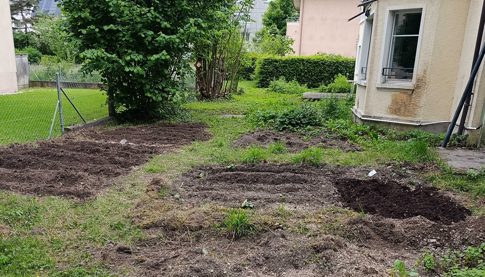

In May 2025 the decision was taken to start a vegetable garden on the south side of the Jugendhaus at the Bruder Klaus Church at Kreuzplatz, Biel. There are five separate garden plots and a shared spice garden.

__Planted 2025__

- Mostly planted beans in the four initial garden plots because they are hardy, tolerate different soils and fix nitrogen.
- In addition, plenty of melons and squashes, and a couple of tomatoes and peppers.
- Mint started in the spice garden.
- Consolidated lemon balm (*Melissa officinalis*) in the spice garden.

<table>
  <tr>
    <td style="text-align: center;">
       
      <small>Squash – May 30, 2025</small>
    </td>
    <td style="text-align: center;">
       
      <small>Beans – May 30, 2025</small>
    </td>
  </tr>
</table>

__To Do For 2025__

- Scavenge sticks, rocks, moss and grass tufts to create paths between the plots.
- Finish preparing plot 5 and expand the spice garden.
- Exchange some of the gravelly soil for richer soil from the wildflower meadow.
- Transfer and organize the strawberry patches.
- Weed, water, and otherwise maintain the garden!

__Interested?__

For 2025, there is space available (although most is planted already by Gabrial Erismann, you are free to collect the vegetables and fruits and claim it for next year!). There are two open garden spots — please reach out to Bruder Klaus Church or Gabrial Erismann if you live *nearby* and are interested in upkeeping a plot!
