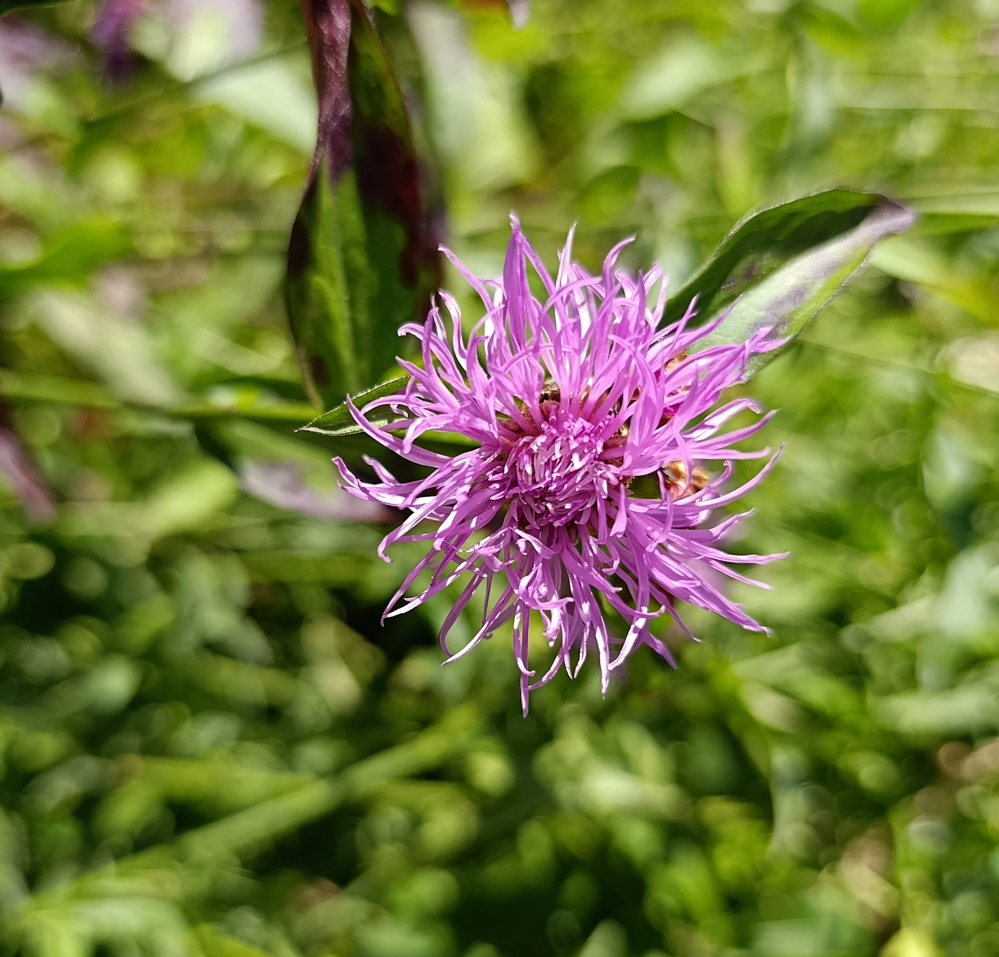
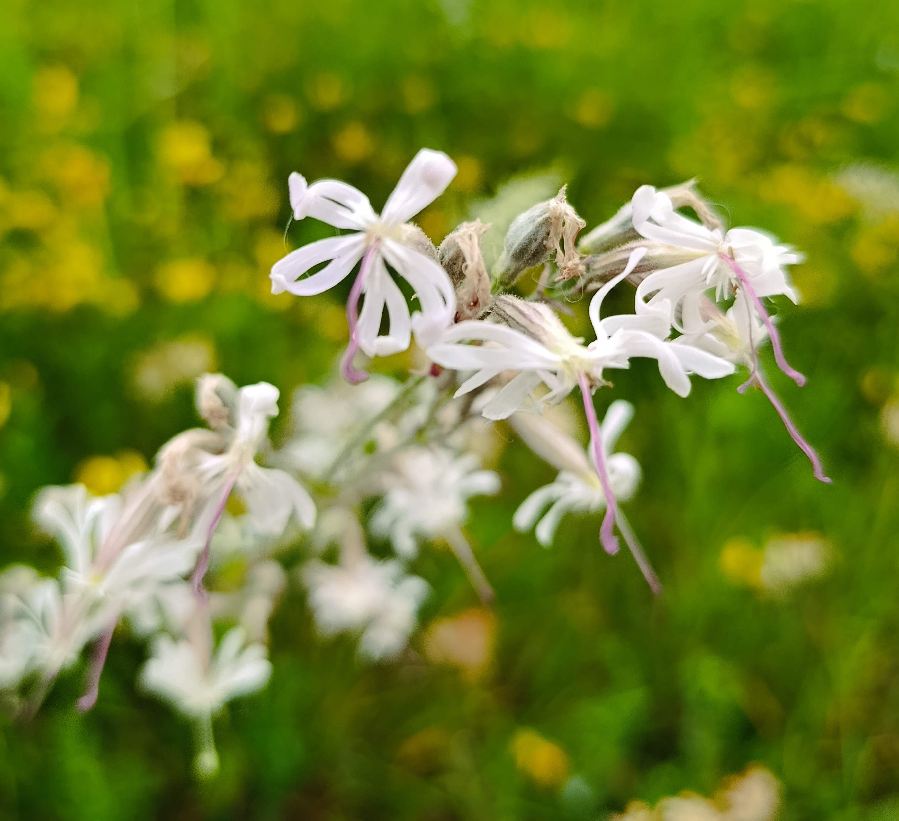

The roughly 400m² meadow on the grounds of the Bruder Klaus Church is a beautiful patch of biodiversity and nature in the heart of the Madretsch neighborhood. While it retains some of its beautiful flowers (see below), it is starting to overgrow with grasses and shrubs and lose some of its wildflower meadow qualities. The goal is to restore the meadow, improve it beyond its original state, and leave an easy to maintain wildflower meadow that can serve educational and biodiversity purposes for the neighborhood.

|  |  |
|:----------------:|:---------------------------------------:|
|  |          |

> Some flowers, 30 Mai 2025

__Goal 1: Regeneration__
The first step is to regenerate the meadow after a few years of being left to its own devices.

- **Remove dominant grasses** from selected areas to make space for wildflowers.
- **Cut back or remove young shrubs** from the meadow center (fruit trees will remain).
- **Collect wildflower seeds** starting in June, especially from known spots (e.g. *Rhinanthus sp.* to manage grasses).
- **Exchange overly rich or compacted soil** with poorer soil from the vegetable garden to encourage specialist species.
- **Add natural structures** such as wood piles, fallen logs, sandy mounds, and stones.

There is a lot of grass that is outcompeting the wildflowers, as are some of the shrubs and pioneer tree species which can be seen sprouting upwards as well.

__Goal 2: Valorization__
The second step is to demonstrate the value of the wildflower meadow.

- **Create and publish a species inventory** (plants and insects).
- **Improve physical access** by creating a **narrow observation path** (e.g. a cross or “+” shape) for care and access. 
- **Create digital access** using GitHub Pages and Streamlit.
- **Pursue ecological recognition or certification**, starting with [ProNatura](https://www.pronatura.ch/fr/bonjournature).

Ultimately, these efforts aim to establish a species-rich, low-maintenance wildflower meadow in this pocket of urban nature — made possible thanks to the stewardship of the Bruder Klaus Church.
