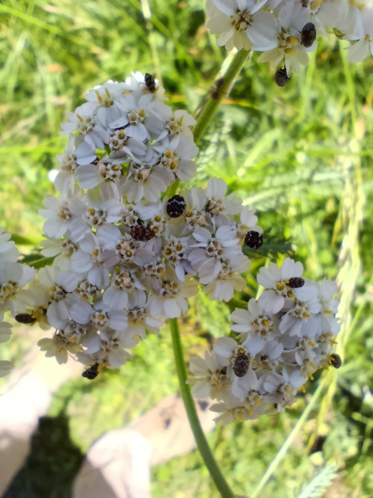
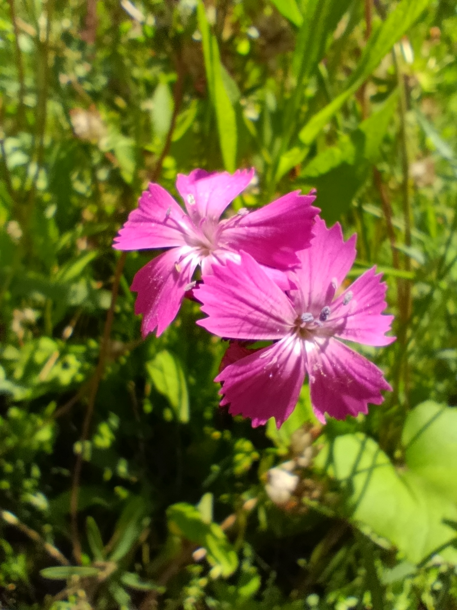
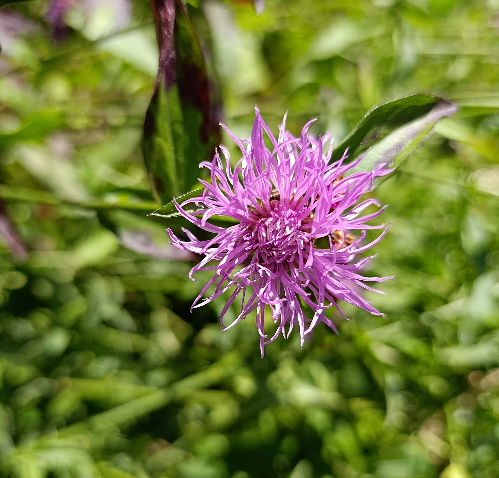
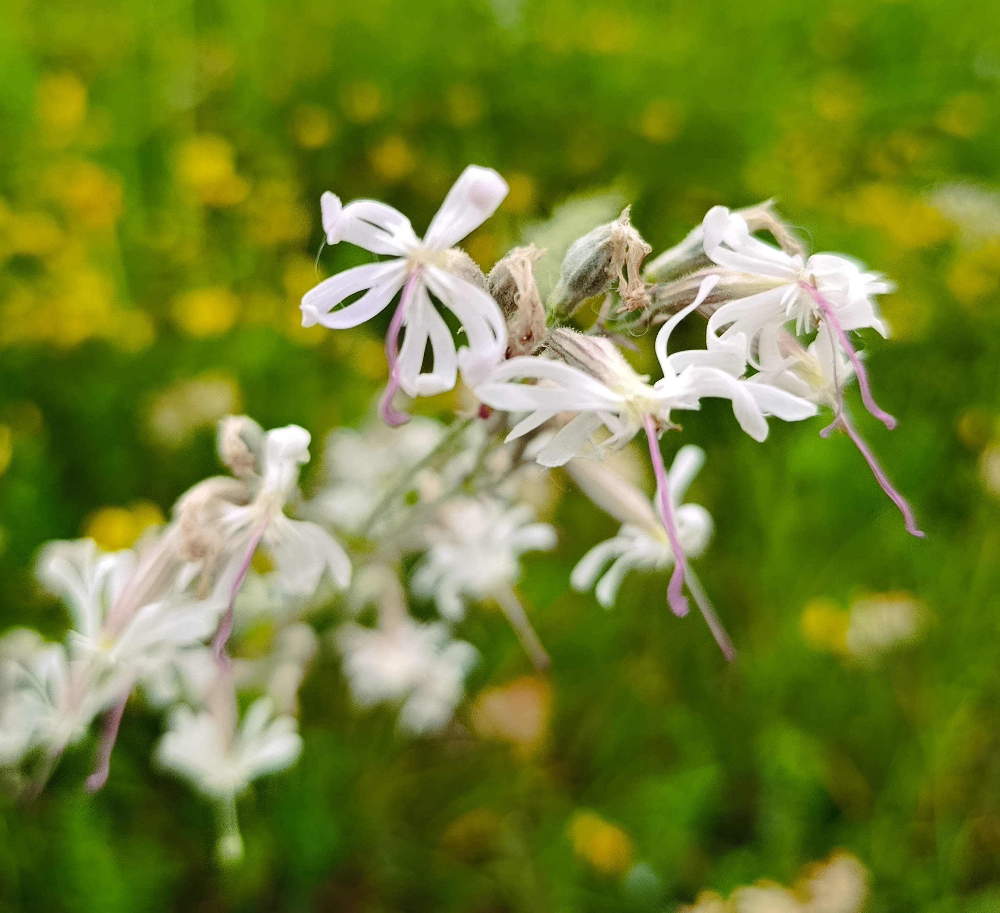

La prairie d’environ 400 m² située sur le terrain de l’église Bruder Klaus est un bel îlot de biodiversité et de nature au cœur du quartier de Madretsch. Bien que certaines fleurs soient encore présentes (voir ci-dessous), la prairie est progressivement envahie par les herbes hautes et les arbustes, perdant peu à peu son caractère de prairie fleurie. L’objectif est de restaurer cet espace, de l’améliorer par rapport à son état d’origine, et de créer une prairie facile à entretenir, au service de l’éducation et de la biodiversité locale.

|  |  |
|:----------------:|:-------------------------------------:|
|  |        |

> Quelques fleurs le 30 Mai 2025

__Objectif 1 : Régénération__  
La première étape consiste à restaurer la prairie après quelques années sans entretien.

- **Retirer les graminées dominantes** sur certaines zones pour favoriser les fleurs sauvages.
- **Tailler ou éliminer les jeunes arbustes** au centre de la prairie (les arbres fruitiers sont conservés).
- **Récolter des graines de fleurs sauvages** dès juin, notamment sur des stations connues (ex. *Rhinanthus sp.* pour réguler les graminées).
- **Remplacer les sols trop riches ou compactés** par de la terre plus pauvre issue du potager pour favoriser les espèces spécialisées.
- **Ajouter des structures naturelles** : tas de bois, troncs couchés, buttes sableuses, pierres.

  
Une grande quantité d’herbe, d’arbustes et de jeunes arbres pionniers commence à supplanter les fleurs sauvages.

__Objectif 2 : Valorisation__  
La seconde étape vise à mettre en valeur la prairie fleurie.

- **Créer et publier un inventaire des espèces** (plantes et insectes).
- **Améliorer l’accès physique** avec un **petit sentier d’observation** (en croix ou en « + ») pour l’entretien et la visite.
- **Créer un accès numérique** via GitHub Pages et Streamlit.
- **Rechercher une reconnaissance ou certification écologique**, en commençant par [ProNatura](https://www.pronatura.ch/fr/bonjournature).

À terme, ces actions permettront d’installer une prairie fleurie riche en espèces et facile à entretenir — grâce à l’engagement de l’église Bruder Klaus.
