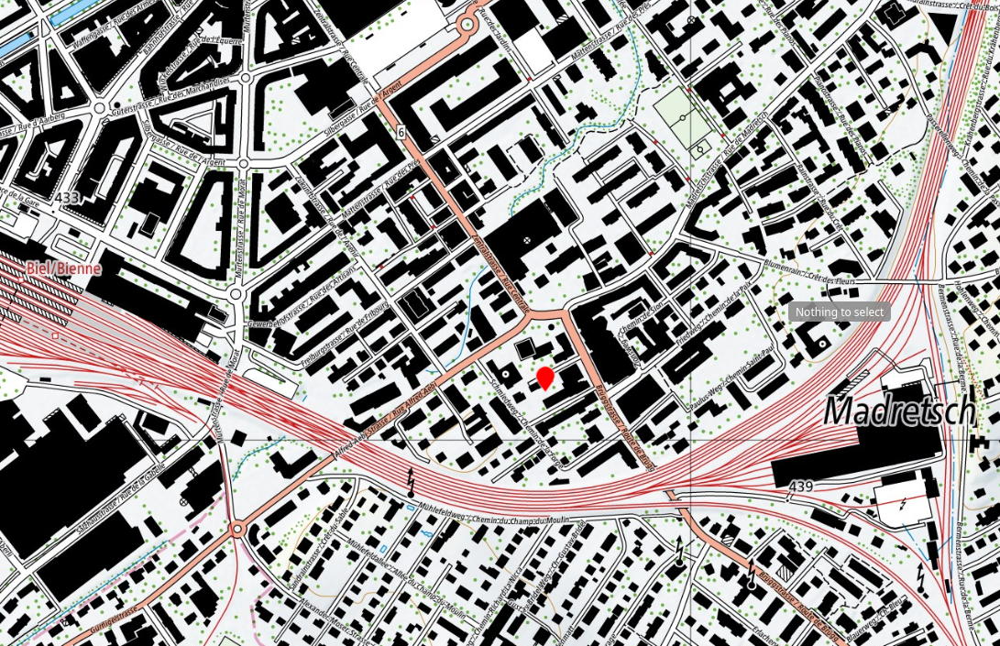

# 🌱 Welcome to the Bruder Klaus Garden / Bienvenue au Jardin Bruder Klaus / Willkommen im Bruder Klaus Garten

Select your language / Sélectionnez votre langue / Sprache auswählen

- 🇬🇧 [English](en/index.md)
- 🇫🇷 [Français](fr/index.md)
- 🇩🇪 [Deutsch](de/index.md)

> 📍 [Located at Bruder Klaus Church Jugendhaus, Zionsweg 8–12, 2503 Biel](https://maps.app.goo.gl/xL3wt9kePSb8x6Mb7)  

> Presence on Saturdays, 9:00–11:00 / Présence les samedis de 9h à 11h / Anwesenheit samstags von 9:00–11:00

